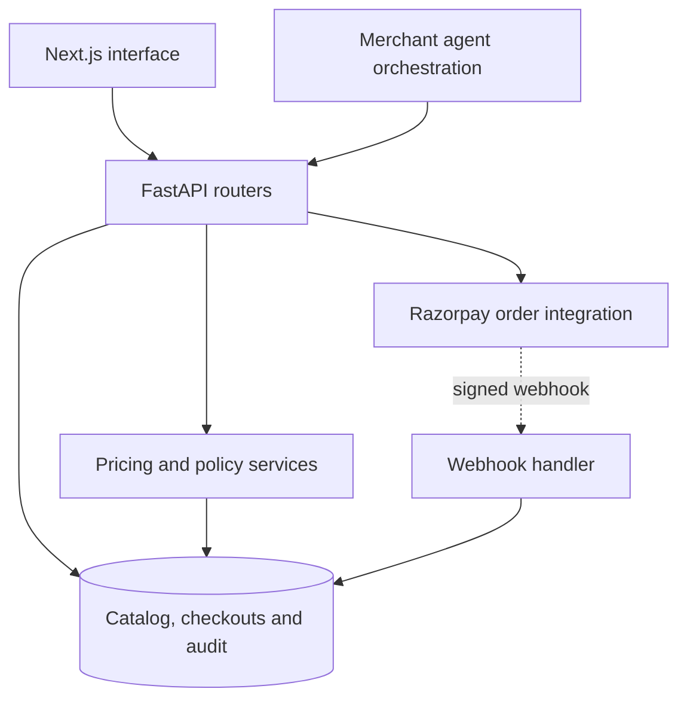

# PayPilot AI

An agentic commerce demo that separates product discovery from checkout authority. FastAPI owns pricing and policy checks; a Next.js interface exposes purchases and checkout audit events.

Built for the Razorpay AI Buildathon. This is a hackathon MVP, not a production payment platform.

## Implemented boundaries

| Concern | Implementation |
| --- | --- |
| Pricing | Products and offers are read from the database; totals are recomputed at checkout creation, update and completion |
| Spending authority | Ed25519-signed mandates and merchant-side transaction/daily limits are checked before order creation |
| Checkout retries | Existing checkout/order results are returned for matching retry paths |
| Inventory | Stock is moved into a reservation before order creation; timeout and payment-failure paths release reservations |
| Payments | Razorpay order creation uses mock mode without keys or the configured Razorpay integration with keys |
| Completion | Signed `payment.captured` webhook handling updates checkout/order state; order creation alone is not payment completion |
| Audit | Checkout events expose policy decisions, order creation, webhook handling and failures |

These mechanisms describe the code paths, not production guarantees or proof under concurrent load.

## Architecture



Groq-backed orchestration is optional. Without a configured key and model, a deterministic catalog-search fallback supports local demos. The checkout engine derives prices from database records rather than LLM output.

## Run locally

```bash
git clone https://github.com/mang-os/PayPilot-AI.git
cd PayPilot-AI/razorpay-agentic-commerce
cp .env.example .env
# Review .env and configure the demo agent and optional external integrations.
docker compose up --build
```

Compose starts PostgreSQL, runs backend migrations and demo seeding, and starts the FastAPI and Next.js services.

- Interface: http://localhost:3000
- Health: http://localhost:8000/health
- Interactive API: http://localhost:8000/docs

Review `.env.example` for frontend agent credentials and backend integration settings. The frontend purchase path requires the configured demo agent identity. Keep secrets out of commits. Without Razorpay keys, order creation is mocked; webhook signature checking remains enabled. For provider testing, use Razorpay Test Mode credentials.

See the [application guide](razorpay-agentic-commerce/README.md) for non-Docker startup and scripted scenarios. That older guide contains historical validation statements; it is not a fresh verification report.

## Tests and verification

Backend tests include authentication, server-derived pricing, policy rejection, duplicate checkout/completion paths, simulated timeout recovery and catalog-result constraints. Frontend regression tests cover transaction progress.

From `razorpay-agentic-commerce/`:

```bash
docker compose exec backend pytest
cd frontend
npm install
npx tsc --noEmit
node --test tests/transaction-progress.test.cjs
npm run build
```

The frontend build requires access to its configured Google Fonts. No passing test count or benchmark result is asserted here. This repository currently has no GitHub Actions workflow or published GitHub release.

## Explore the implementation

| Path | Purpose |
| --- | --- |
| [Checkout engine](razorpay-agentic-commerce/backend/app/services/checkout_engine.py) | Catalog-derived pricing, offers and totals |
| [Policy engine](razorpay-agentic-commerce/backend/app/services/policy_engine.py) | Agent, mandate, spending and inventory checks |
| [Mandate signatures](razorpay-agentic-commerce/backend/app/services/mandate_service.py) | Ed25519 signing and verification |
| [Checkout router](razorpay-agentic-commerce/backend/app/routers/acp_checkouts.py) | Creation, updates, completion and timeout recovery |
| [Webhook router](razorpay-agentic-commerce/backend/app/routers/webhooks.py) | Signature-gated payment event handling |
| [Backend tests](razorpay-agentic-commerce/backend/tests) | API and orchestration regression tests |
| [Frontend regression test](razorpay-agentic-commerce/frontend/tests/transaction-progress.test.cjs) | Transaction progress rendering rules |
| [Demo recording guide](razorpay-agentic-commerce/scripts/demo-video/README.md) | Demo capture tooling |

## Scope and limitations

- Mock order creation does not move money. A configured Razorpay order is not a completed payment.
- Webhook signatures are checked, but the handler does not explicitly compare captured amount/currency with expected checkout totals.
- Checkout completion contains multiple database commits. Current code does not establish atomic, concurrency-safe inventory and mandate consumption across the full payment boundary.
- Pricing uses floating-point conversions and a configurable flat tax rate; it is not a production accounting or GST implementation.
- Demo key handling and operational/security configuration require review before deployment.
- Existing docs contain historical local validation claims. A fresh PostgreSQL integration run, concurrency tests and hosted CI are needed before stronger guarantees are advertised.

## Documentation and release direction

The application guide currently contains the detailed design narrative. See [architecture](docs/architecture.md), [payment boundaries](docs/payment-boundaries.md) and [verification](docs/verification.md) for source-grounded design and reproduction details. A benchmark report should only be added after reproducible workloads record environment, dataset, duration, latency percentiles, error categories and raw results.

[Releases](https://github.com/mang-os/PayPilot-AI/releases) will contain published versions when available. No stable release is currently claimed.
